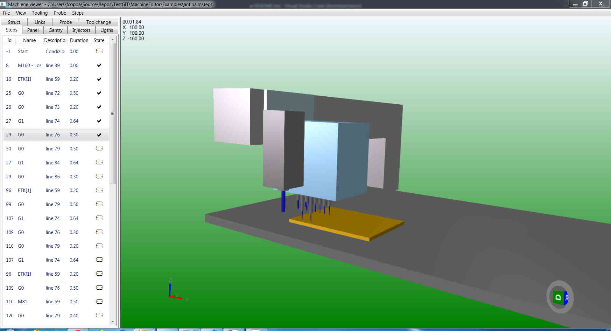

# MachineEditor solution
This solution contains projects for the analysis of the movement of CNC machines. The machine is represented by a tree structure that determines the relationship between the various elements (mesh - .stp file); through this structure it is possible to view the dimensions of the machine elements and their interaction even during movements. The [**HelixToolkit.Wpf**](https://github.com/helix-toolkit/helix-toolkit/tree/master/Source/HelixToolkit.Wpf) library is used for 3D visualization. 

## Examples
This folder contains the files to simulate a simple 3 axis CNC being machined.
* **Simple3AxesCnc.xml**: machine structure, it could be edit by [MacineEditor](#MachineEditor) and load by [MachineViewer.SimpleApp](#MachineViewer.SimpleApp) or [MachineViewer](https://github.com/federicocoppa75/MachineSimulation.DX#machineviewer)
* **Models**: contains machene elements models (*.stl file)
* **SimpleToolSet.tools**: tools database, it could be edit by [ToolEditor](#ToolEditor)
* **SimpleTooling.tooling**: tooling example, it could be edit edit by [ToolingEditor](#ToolingEditor)
* **Simple3AxesCnc.mcfgx**: machine archive (contains machine structure and elements models, no link to other file with absolute path like *.xml machine struct), it could be edit by [MacineEditor](#MachineEditor) and load by [MachineViewer.SimpleApp](#MachineViewer.SimpleApp) or [MachineViewer](https://github.com/federicocoppa75/MachineSimulation.DX#machineviewer)
* **Simple3AxesCnc.env**: working environment (contains structure, elements model, tools and tooling), it could be save and load by [MachineViewer](https://github.com/federicocoppa75/MachineSimulation.DX#machineviewer)
* **antina.msteps**: example of machinary, it could be edit by [MachineSteps.Editor](#MachineSteps.Editor)

## MachineEditor
Machine editor (MachineEditor.exe), allows creation, load and modification of machine struct. The machine struct could be save as simple *.xml file (it link machine elements models with absolute path) or archive *.mcfgx (portable version of struct and models with out the problem of absolute path of the file *.stl).
You can start by load the archive example **Simple3AxesCnc.mcfgx** (command File->Import from archive), when you open that file you can see a static view of the machine (no movment), you can add and remove element in the machine structure and can change data and model of each single element. If you select an element of structure tree you can se its data, here you can find the link of the model file *.stl of that element.After import, you can find in the folder of the file **Simple3AxesCnc.mcfgx** another folter with the same name of the file, inside you you can see the file **machine.xml** and some file *.stl. You can open (command File->Open), edit and save (command File->Save) the file **machine.xml**, but the link of each file *.stl has an absolute path; if you want a portable format you have to save your machine as file *.mcfgx (File->Export to archive).

<!-- ##MachineModels
##MachineModels.IO -->

## MachineSteps.Editor
Machine movement editor (file *.msteps)

## MachineSteps.IsoInterpreter.SimpleApp
Application for converting the ISO for cx100 into machine steps

<!-- ## MachineSteps.Models
## MachineSteps.Plugins.IsoConverterBase
## MachineSteps.Plugins.IsoInterpreter
## MachineSteps.Plugins.IsoIstructionAttributes
## MachineSteps.Plugins.IsoIstructions
## MachineSteps.Plugins.IsoParser
## MachineSteps.Plugins.StepsViewer -->
## MachineSteps.Viewer
Application for viewing machine movements.
If you have the machine now you can move it: you have to load the machine (*.xml or *.mcfgx) in MachineSteps.Viewer.exe (command File->Open or File->Open archive), then you can move the elements with the sliders or the checks in the "Links" tab. If you want to execute a list of movements, you ave to create a file *.msteps, you can do it by [MachineSteps.Editor](#MachineSteps.Editor). You can find an example in the folder "Examples" (file **antina.msteps**); if you open that file in MachineSteps.Viewer.exe (command Steps->Load) you can see all machine steps in the "Steps" tab, now you can move the machine step by step or continuosly to to the end if you select "Steps->Dynamic transition" and "Steps->Auto step over" options.
If you want, you can load a tooling file example **SimpleTooling.tooling** (command Tooling->Load), this file could be load by [ToolingEditor](#ToolingEditor).
If you have load machine and tooling, you can save that environment (command File->Save environment); you can load the eample Simple3AxesCnc.env (command File->Open environment).

<!-- ## MachineViewer
## MachineViewer.Plugins.Common
## MachineViewer.Plugins.Injectors.SimpleManipolator
## MachineViewer.Plugins.Links.SimpleManipolator -->

## MachineViewer.Plugins.Panel.MaterialRemoval
This is the library that implements the material removal. It uses [**geometry3Sharp**](https://github.com/gradientspace/geometry3Sharp).

<!-- ## MachineViewer.Plugins.Panel.SimpleManipolator
## MachineViewer.Plugins.ToolChange.SimpleManipolator
## MachineViewer.Plugins.Tooling.SimpleManipolator -->

## MachineViewer.SimpleApp
Test application for various machine model display functions, it could load the machien struct (file *.xml or *.mcfgx) and relative tooling (file *.tooling).

<!-- ## MachineViewer.SystemsAssembler
## MachineViewModels
## MachineViewModelUtils -->

## ModelSemplifier
Application for the simplification of models (mesh - .stl file) of the machine parts.

## TestIsoParser
Driver application for the MachineSteps.Plugins.IsoParser module.

## TestMaterialRemoval
This video shows the test application for the material removal library.

<!-- [comment]:## TestMovePanel
[comment]:## TestTrasform -->

## ToolEditor
This is a tool to create a tool set that can be used to create a tooling (via [ToolingEditor](#ToolEditor)) that can then be loaded from a machine model loaded in [MachineViewer.SimpleApp](#MachineViewer.SimpleApp) or [MachineSteps.Viewer](#MachineSteps.Viewer).

## ToolingEditor
This is a tool to create a tooling which can then be loaded from a machine model loaded in [MachineViewer.SimpleApp](#MachineViewer.SimpleApp) or [MachineSteps.Viewer](#MachineSteps.Viewer).

