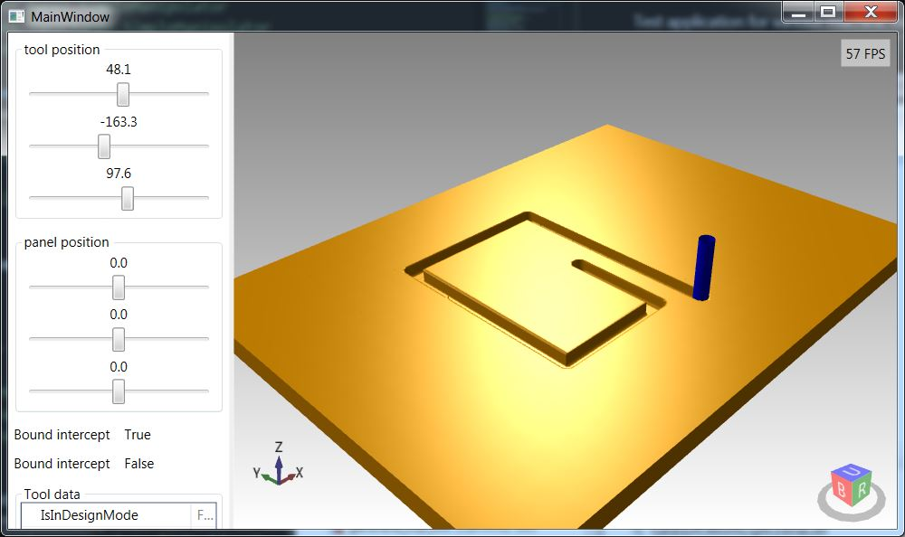
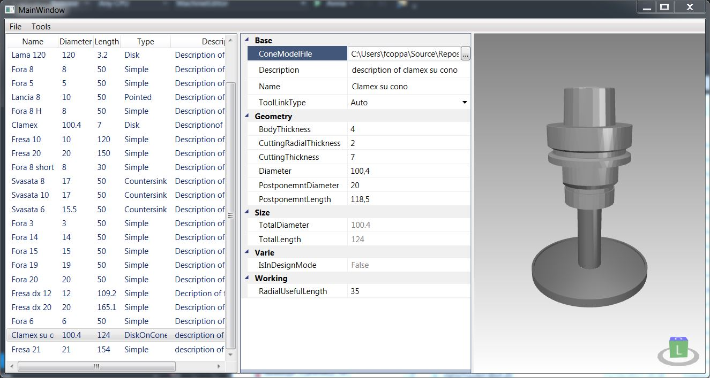
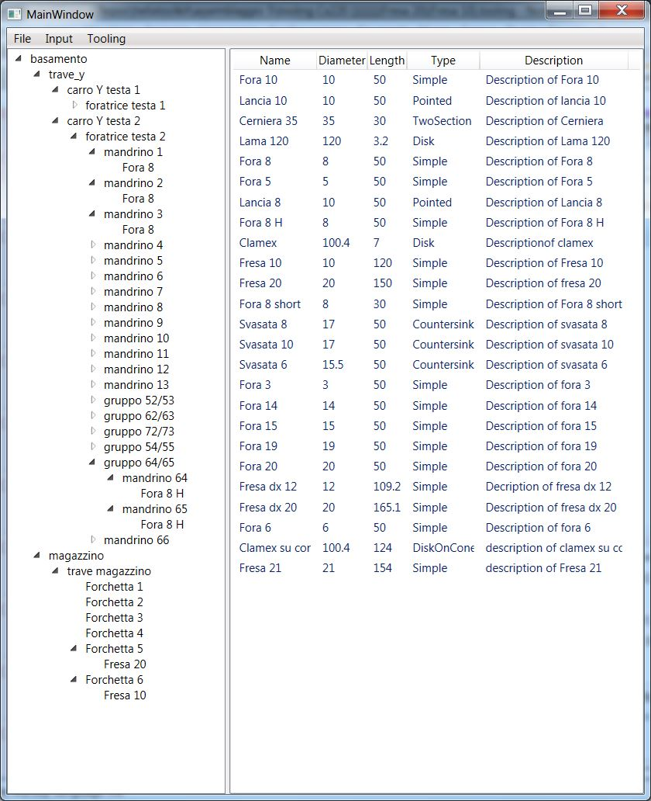

# MachineEditor
This solution contains projects for the analysis of the movement of CNC machines. The machine is represented by a tree structure that determines the relationship between the various elements (mesh - .stp file); through this structure it is possible to view the dimensions of the machine elements and their interaction even during movements. The [**HelixToolkit.Wpf**](https://github.com/helix-toolkit/helix-toolkit/tree/master/Source/HelixToolkit.Wpf) library is used for 3D visualization. 

## MachineEditor
Editor per le macchine, permette la creazione e la modifica.

<!-- ##MachineModels
##MachineModels.IO -->

## MachineSteps.Editor
Machine movement editor

## MachineSteps.IsoInterpreter.SimpleApp
Application for converting the ISO for cx100 into machine steps

<!-- ## MachineSteps.Models
## MachineSteps.Plugins.IsoConverterBase
## MachineSteps.Plugins.IsoInterpreter
## MachineSteps.Plugins.IsoIstructionAttributes
## MachineSteps.Plugins.IsoIstructions
## MachineSteps.Plugins.IsoParser
## MachineSteps.Plugins.StepsViewer -->
## MachineSteps.Viewer
Application for viewing machine movements

<!-- ## MachineViewer
## MachineViewer.Plugins.Common
## MachineViewer.Plugins.Injectors.SimpleManipolator
## MachineViewer.Plugins.Links.SimpleManipolator -->

## MachineViewer.Plugins.Panel.MaterialRemoval
This is the library that implements the material removal. It uses [**geometry3Sharp**](https://github.com/gradientspace/geometry3Sharp).

<!-- ## MachineViewer.Plugins.Panel.SimpleManipolator
## MachineViewer.Plugins.ToolChange.SimpleManipolator
## MachineViewer.Plugins.Tooling.SimpleManipolator -->

## MachineViewer.SimpleApp
Test application for various machine model display functions.

<!-- ## MachineViewer.SystemsAssembler
## MachineViewModels
## MachineViewModelUtils -->

## ModelSemplifier
Application for the simplification of models (mesh - .stl file) of the machine parts.

## TestIsoParser
Driver application for the MachineSteps.Plugins.IsoParser module.

## TestMaterialRemoval
This video shows the test application for the material removal library.

<!-- [comment]:## TestMovePanel
[comment]:## TestTrasform -->

## ToolEditor
This is a tool to create a tool set that can be used to create a tooling (via [ToolingEditor](#ToolEditor)) that can then be loaded from a machine model loaded in [MachineViewer.SimpleApp](#MachineViewer.SimpleApp) or [MachineSteps.Viewer](#MachineSteps.Viewer).

## ToolingEditor
This is a tool to create a tooling which can then be loaded from a machine model loaded in [MachineViewer.SimpleApp](#MachineViewer.SimpleApp) or [MachineSteps.Viewer](#MachineSteps.Viewer).

